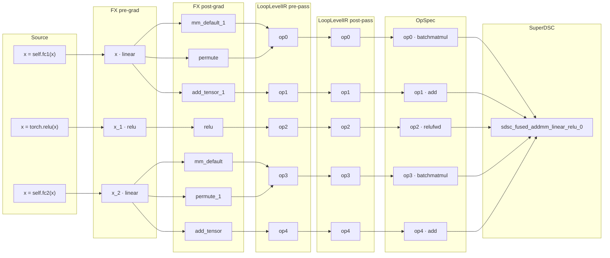

# Example Audit: `SimpleMLP` — Source-to-Kernel Provenance

> Generated: 2026-07-15 14:22 &nbsp;|&nbsp; Issue: [torch-spyre#2574](https://github.com/torch-spyre/torch-spyre/issues/2574)

One worked example of the provenance audit (see the README for how to run it): `SimpleMLP` traced in-process through a single cache-defeated `torch.compile`. Measurement-only — every table and the lineage graph below are computed from the captured compile-path objects.

This is a committed **example snapshot**: the `Generated` timestamp and the `debug_handle` ids are specific to this run and machine (the id is a content hash of the source location, which includes an absolute path), so they change when regenerated — run `audit.py` to reproduce it for your own setup.

## Source → Kernel Lineage

How each source line flows through the pipeline — **Source → FX pre-grad → FX post-grad → LoopLevelIR pre-pass → LoopLevelIR post-pass → OpSpec → SuperDSC**. A **fan-out** is a decomposition (e.g. `linear` → `permute` + `mm` + `add`); a **fan-in** is a fusion (several OpSpec ops → one kernel). An op with no source of its own attaches to every source-bearing producer whose buffer it consumes (multi-source). Node/IR transformation only — field survival is the matrix below.

## Stage × Field Matrix

✓ present & non-empty on **all** instances &nbsp; ◐ on some (n/total) &nbsp; ✗ reachable here but measured **empty/absent** (dropped) &nbsp; – not created yet here, **or** carried indirectly inside another field (see that field's row).

Every column tests **population** (the field exists *and* carries non-empty content; `0` counts as content, `None`/`[]`/`{}`/`""` do not). Own-slot cells are measured directly; whether an absent field reads *carried indirectly* (`–`) or *dropped* (`✗`) at the OpSpec / SuperDSC columns is **derived** from what `debug_handle` retains, not measured.

The **Layer** column marks whether a field lives on the FX node (`FX`), the IR `ComputedBuffer` (`IR`), or the `debug_handle` (`Spyre`). The two IR columns are the same LoopLevelIR before and after the Spyre pre-scheduling passes: **LoopLevelIR (pre-pass)** is the lowered IR entering them, **LoopLevelIR (post-pass)** is after they mutate it in place. These map to issue #2574's "Inductor passes" → "LoopLevelIR".

| Layer | Field | FX Graph (pre-grad) | FX Graph (post-grad) | LoopLevelIR (pre-pass) | LoopLevelIR (post-pass) | OpSpec | SuperDSC JSON |
| --- | --- | --- | --- | --- | --- | --- | --- |
| FX | `stack_trace` | ✓ | ◐ 3/7 | – | – | – | – |
| FX | `nn_module_stack` | ◐ 2/3 | ◐ 2/7 | – | – | ✗ | ✗ |
| FX | `source_fn_stack` | ✓ | ◐ 3/7 | – | – | ✗ | ✗ |
| FX | `original_aten` | – | ✓ | – | – | – | – |
| FX | `from_node` | – | ◐ 3/7 | – | – | ✗ | ✗ |
| IR | `origins` | – | – | ✓ | ✓ | – | – |
| IR | `origin_node` | – | – | ✓ | ✓ | – | – |
| IR | `traceback` | – | – | ✗ | ✗ | ✗ | ✗ |
| IR | `get_stack_traces` | – | – | ◐ 3/5 | ◐ 3/5 | – | – |
| Spyre | `debug_handle` | – | – | – | – | ✓ | ✓ |

## Stage 2a — FX Graph (pre-grad): 3 compute nodes

Dynamo traces the model into an FX graph; each node still carries its Python-source metadata.

Tracked fields: `stack_trace` (user source `file:line`), `nn_module_stack` (owning `nn.Module` path), `source_fn_stack` (source fn/op that produced it), `original_aten` (ATen op it lowered from), `from_node` (producing pass/transform chain).

All observed `node.meta` keys: `['example_value', 'mutation_region_id', 'nn_module_stack', 'source_fn_stack', 'stack_trace']`.

| Node | target | `stack_trace` | `nn_module_stack` | `source_fn_stack` | `original_aten` | `from_node` | source line |
| --- | --- | --- | --- | --- | --- | --- | --- |
| `x` | `<built-in function linear>` | `str` | `dict` | `list` | ✗ | ✗ | `x = self.fc1(x)` |
| `x_1` | `<built-in method relu of type object at 0x7fc0e64078a0>` | `str` | ✗ | `list` | ✗ | ✗ | `x = torch.relu(x)` |
| `x_2` | `<built-in function linear>` | `str` | `dict` | `list` | ✗ | ✗ | `x = self.fc2(x)` |

## Stage 2b — FX Graph (post-grad): 7 compute nodes

AOTAutograd/Inductor lower and decompose the graph (e.g. `linear` → `permute` + `mm` + `add`); synthesized nodes keep only part of the metadata.

Tracked fields: `stack_trace` (user source `file:line`), `nn_module_stack` (owning `nn.Module` path), `source_fn_stack` (source fn/op that produced it), `original_aten` (ATen op it lowered from), `from_node` (producing pass/transform chain).

All observed `node.meta` keys: `['from_node', 'mutation_region_id', 'nn_module_stack', 'original_aten', 'seq_nr', 'source_fn_stack', 'stack_trace', 'tensor_meta', 'val']`.

| Node | target | `stack_trace` | `nn_module_stack` | `source_fn_stack` | `original_aten` | `from_node` | source line |
| --- | --- | --- | --- | --- | --- | --- | --- |
| `permute` | `aten.permute.default` | `str` | `dict` | `list` | `OpOverload` | `list` | `x = self.fc1(x)` |
| `mm_default_1` | `aten.mm.default` | ✗ | ✗ | ✗ | `OpOverload` | ✗ | — |
| `add_tensor_1` | `aten.add.Tensor` | ✗ | ✗ | ✗ | `OpOverload` | ✗ | — |
| `relu` | `aten.relu.default` | `str` | ✗ | `list` | `OpOverload` | `list` | `x = torch.relu(x)` |
| `permute_1` | `aten.permute.default` | `str` | `dict` | `list` | `OpOverload` | `list` | `x = self.fc2(x)` |
| `mm_default` | `aten.mm.default` | ✗ | ✗ | ✗ | `OpOverload` | ✗ | — |
| `add_tensor` | `aten.add.Tensor` | ✗ | ✗ | ✗ | `OpOverload` | ✗ | — |

## Stage 3 — LoopLevelIR (pre-pass): 5 operations

FX nodes lower into LoopLevelIR `ComputedBuffer`s entering the Spyre pre-scheduling passes.

Tracked fields: `origins` (FX nodes that lowered into this buffer), `origin_node` (single representative FX node (nullable)), `traceback` (IR-node creation-site traceback), `get_stack_traces` (source lines derived from `origins`).

All observed `ComputedBuffer` attributes: `['annotations', 'data', 'layout', 'name', 'operation_name', 'origin_node', 'origins', 'traceback']`.

| Op | `origins` | `origin_node` | `traceback` | `get_stack_traces` |
| --- | --- | --- | --- | --- |
| `op0` | `mm_default_1`, `permute` | `mm_default_1` | ✗ | ✓ |
| `op1` | `add_tensor_1` | `add_tensor_1` | ✗ | ✗ |
| `op2` | `relu` | `relu` | ✗ | ✓ |
| `op3` | `mm_default`, `permute_1` | `mm_default` | ✗ | ✓ |
| `op4` | `add_tensor` | `add_tensor` | ✗ | ✗ |

## Stage 4 — LoopLevelIR (post-pass): 5 operations

The same IR after the pre-scheduling passes mutate it in place.

Tracked fields: `origins` (FX nodes that lowered into this buffer), `origin_node` (single representative FX node (nullable)), `traceback` (IR-node creation-site traceback), `get_stack_traces` (source lines derived from `origins`).

All observed `ComputedBuffer` attributes: `['annotations', 'data', 'dim_hints', 'layout', 'name', 'op_it_space_splits', 'operation_name', 'origin_node', 'origins', 'traceback']`.

| Op | `origins` | `origin_node` | `traceback` | `get_stack_traces` |
| --- | --- | --- | --- | --- |
| `op0` | `mm_default_1`, `permute` | `mm_default_1` | ✗ | ✓ |
| `op1` | `add_tensor_1` | `add_tensor_1` | ✗ | ✗ |
| `op2` | `relu` | `relu` | ✗ | ✓ |
| `op3` | `mm_default`, `permute_1` | `mm_default` | ✗ | ✓ |
| `op4` | `add_tensor` | `add_tensor` | ✗ | ✗ |

## Stage 5 — OpSpec: 5 ops

Each scheduled `ComputedBuffer` becomes an `OpSpec` (the device op); `debug_handle` carries source provenance onto it, while the `origins` / `origin_node` shown here are read from the input buffer (not stored on `OpSpec`).

Tracked fields: `origins` (FX nodes that lowered into this buffer), `origin_node` (single representative FX node (nullable)), `debug_handle` (source-to-kernel record (id, source, aten_op, ir_chain, fused_from)).

`OpSpec` declared fields: `['op', 'is_reduction', 'iteration_space', 'args', 'op_info', 'tiled_symbols', 'symbolic_dim_bounds', 'debug_handle']`.

| Spyre op | buffer | `origins` | `origin_node` | `debug_handle` id | source line |
| --- | --- | --- | --- | --- | --- |
| `batchmatmul` | `op0` | `mm_default_1`, `permute` | `mm_default_1` | `3841103980854345041` | `reference_mlp.py:25` |
| `add` | `op1` | `add_tensor_1` | `add_tensor_1` | `605170506422197115` | — |
| `relufwd` | `op2` | `relu` | `relu` | `2003101464082329501` | `reference_mlp.py:26` |
| `batchmatmul` | `op3` | `mm_default`, `permute_1` | `mm_default` | `4917498687135836649` | `reference_mlp.py:27` |
| `add` | `op4` | `add_tensor` | `add_tensor` | `6208522288796453179` | — |

## Stage 6 — SuperDSC: 5 `sdsc_*.json` files (1 kernel)

Each `OpSpec` is serialized to a `sdsc_*.json` kernel spec; the `debug_handle` travels with it (JSON key `debug_handle_`), resolving each kernel back to source.

Tracked (per `debug_handle_`): `id` (stable content hash), `source` (`file:line`), `aten_op`, `fused_from` (constituent handles when fused).

`debug_handle_` present in `5/5` files, non-null in `5/5`.

All observed `debug_handle` keys: `['aten_op', 'fused_from', 'fusion_context', 'id', 'ir_chain', 'source']`.

| Kernel | `sdsc_*.json` | Spyre op | `aten_op` | source line | `fused_from` | `debug_handle` id |
| --- | --- | --- | --- | --- | --- | --- |
| `sdsc_fused_addmm_linear_relu_0` | `sdsc_0.json` | `0_batchmatmul` | `aten.addmm.default` | `reference_mlp.py:25` | `aten.addmm.default`, `aten.linear.default` | `3841103980854345041` |
| `sdsc_fused_addmm_linear_relu_0` | `sdsc_1.json` | `1_add` | `aten.addmm.default` | — | — | `605170506422197115` |
| `sdsc_fused_addmm_linear_relu_0` | `sdsc_2.json` | `2_relufwd` | `aten.relu.default` | `reference_mlp.py:26` | — | `2003101464082329501` |
| `sdsc_fused_addmm_linear_relu_0` | `sdsc_3.json` | `3_batchmatmul` | `aten.addmm.default` | `reference_mlp.py:27` | `aten.addmm.default`, `aten.linear.default` | `4917498687135836649` |
| `sdsc_fused_addmm_linear_relu_0` | `sdsc_4.json` | `4_add` | `aten.addmm.default` | — | — | `6208522288796453179` |

`fused_from` lists the constituent handles' ATen ops (MLIR `FusedLoc`-style lineage). A `—` source line means the handle resolves only to an ATen op (its FX node carried no `stack_trace`), not that the handle is absent.

### `sdsc_fused_addmm_linear_relu_0`

- buffers (5): `op0`, `op1`, `op2`, `op3`, `op4`
- fx origins: `add_tensor`, `add_tensor_1`, `mm_default`, `mm_default_1`, `permute`, `permute_1`, `relu`
- kernel metadata: `# Topologically Sorted Source Nodes: [x, x_1, x_2], Original ATen: [aten.linear, aten.addmm, aten.relu]`
- `sdsc_*.json` files: 5 &nbsp; `debug_handle_` non-null: 5/5
